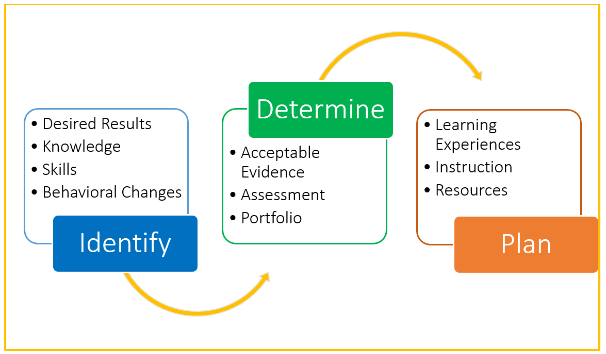
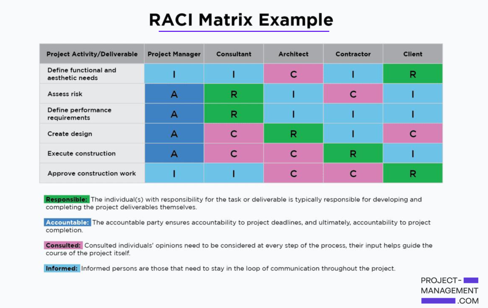

**Goal Setting**
-
- Write down two time management strategies that you can start using in your professional life.
- Explain why you believe that these strategies will be helpful

**Time Managment Stratergy #1**

- Using a task list method Im able to track the tasks that I need to complete. I often find I perform well when I write down my objectives. Utilizing my note pad im able to  highlight small realistic milestones that are achievable. Additionaly benificial blocking out time and loading these to my phone calender allows me to set alarms,deadlines holdimg me accountable.

**Time Managment Stratergy #2**

- Minimizing distractions & Limiting multi-tasking. By writing a to do list to start the day I have a greater command over distractions. As I know im focused on one acitivity for a allocated period and moving on to the next.Orgnaising ahead has served me well in my leisure time(Gym) and equally I believe it will correspond well on this journey.

----
**Reverse Planning: Individual Activity**

 **Understanding AWS and AWS Documentation** 

**5** -  Upon making notes sign up to AWS Skills builder to build on cloud skills and aid online learning(free)
**4** - Take a mock exam on AWS builder to confirm your understanding
**3** - AWS Documentation - Visit home page, click on the most used services  EC2, S3, Lamba, Dynamo DB read and make notes 
**2** - Understand three different models of cloud services: infrastructure as a service (IaaS), platform as a service (PaaS), and software as a service (SaaS) By using slides
**1** - Login to awsrestart.instructure.com - Revisit Topic "What is AWS" slides. Make notes on each slide.
 

----
**Accountability: Individual Activity**

- Use a search engine to research ways to demonstrate accountability. 
- Make a list of at least five ways that you can demonstrate accountability

1. Creating a day plan on phone with alarm reminders before going to bed
2. Being Punctual arriving promptly 
3. Ensuring Im contributing to class discussions at least Four times within a day. 
4. After each lesson taking an 1 hour to go over what you have learnt(Telling my brother and freind, as they would not hesistate to hold me accountable)
5. Completing assingments before deadlines
Increasing study to 1 and half hours on weekend 

---
**RACI** 

Use search engine to learn more about each category in a RACI chart:

- Describe the difference between R and A.
- Describe the difference between C and I.

**R** – Responsible (executes);
**A** – Accountable (checks out the result & carries responsibility);
**C** – Consults before doing/execution (gives input before work is done, has an active role);
**I** – Informs after doing/execution (needs information about project’s progress, decisions, has a passive role).

**Can one person’s name appear in more than one category? Why**

RACI gives clarity to the distribution of accountability within a Product team. For example Consultant and PM. A project manager focuses on a project. A Consultant concentrates on the end product. Mixing these two different roles can compromise the quality of both the project and the end product. Because both roles are closely asscociated chances are that they will both be responsible see table below.

